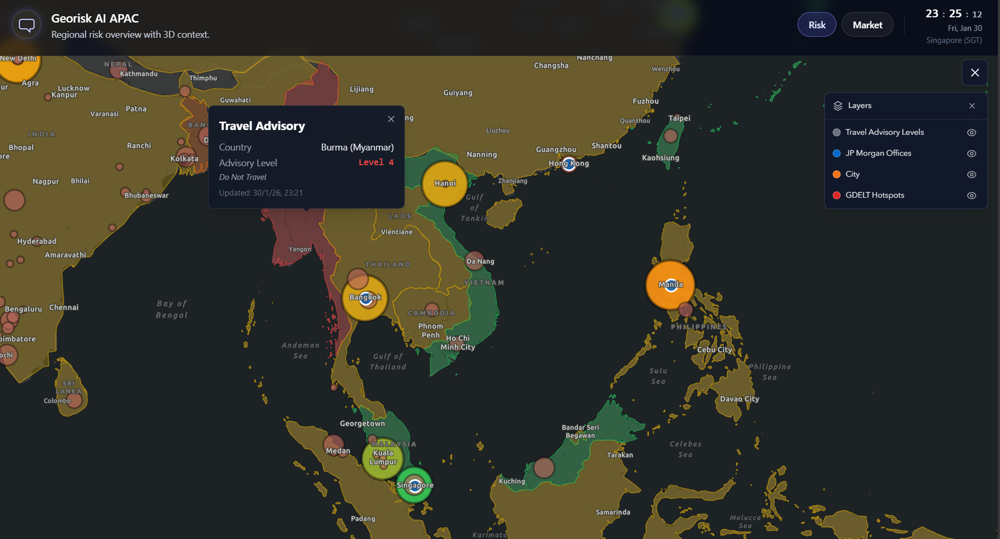

# georiskAIAPAC


## Services
- `frontend`: consists of interactive web map and chatbot
- `agent`: how chat is handled + tool-calling
- `mcp`: risk data API and interfacing with database
- `db`: Postgres

## Start services and clamp down services
```
docker compose up --build
docker compose down -v
```

## .env
Create a `.env` file at the repo root with your credentials.
Example:
```
POSTGRES_USER=georisk
POSTGRES_PASSWORD=georisk123
POSTGRES_DB=georiskdb

GROQ_API_KEY=
GROQ_MODEL=llama-3.1-8b-instant
GOOGLE_API_KEY=
GEMINI_MODEL=gemini-1.5-flash

VITE_BACKEND_MCP=http://localhost:8000
VITE_BACKEND_AGENT=http://localhost:7000

OPENSKY_USERNAME=
OPENSKY_PASSWORD=
```
Optional: [OpenSky](https://github.com/openskynetwork/opensky-api) credentials for `/api/opensky/states` (current flights over APAC); otherwise anonymous rate limits apply.

## Seed risk data manually when instance is up
```
docker compose exec mcp python init_db.py
```

## Format code (Prettier + Black)
With services up, format frontend and backend from the repo root:
```
docker compose exec frontend npm run format
docker compose exec mcp black .
docker compose exec agent black .
```
Check only (no write):
```
docker compose exec frontend npm run format:check
docker compose exec mcp black --check .
docker compose exec agent black --check .
```

## Endpoints and Swagger interface
- Frontend: http://localhost:3000
- Agent API: http://localhost:7000/docs
- MCP API: http://localhost:8000/docs
- Databse: http://localhost:5432/

## Risk calculation references
- Formula: `Risk = 25*military + 25*(1-economy) + 25*(1-safety) + 15*uncertainty + 10*ambassy_advice` (0–100)
- Components:
  - Military (25%): GDELT GEO 2.0 API - Conflict intensity events (last 24h)
  - Economy (25%): World Bank GDP per capita (NY.GDP.PCAP.CD) - Inverted (lower GDP = higher risk)
  - Safety (25%): World Bank intentional homicides per 100k (VC.IHR.PSRC.P5) - Inverted (higher homicides = higher risk)
  - Uncertainty (15%): GDELT DOC 2.0 API - Economic policy uncertainty mentions (last 30 days)
  - Ambassy Advice (10%): US State Department Travel Advisory levels (1-4, converted to risk score)

## Screenshot



For more screenshots, see the [docs](docs/) folder.